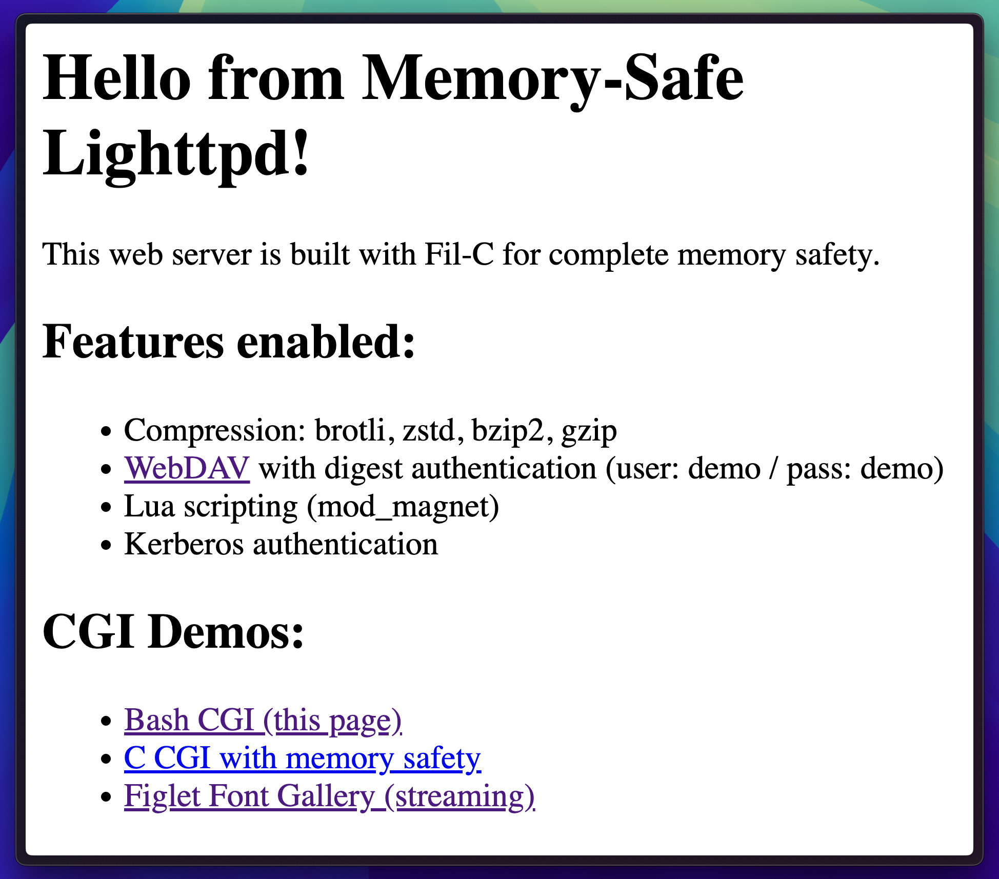
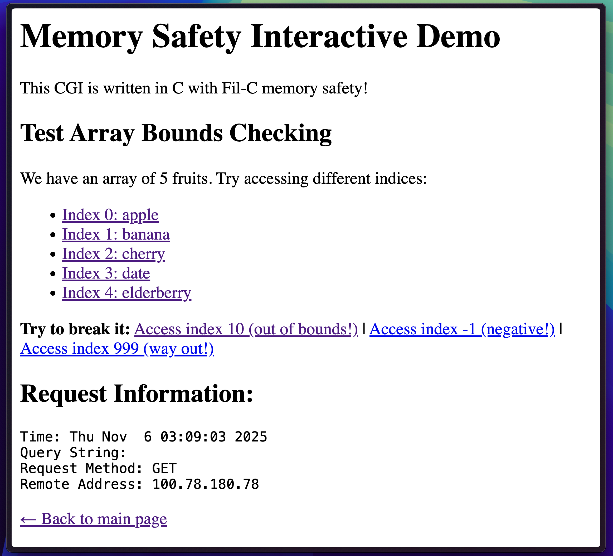
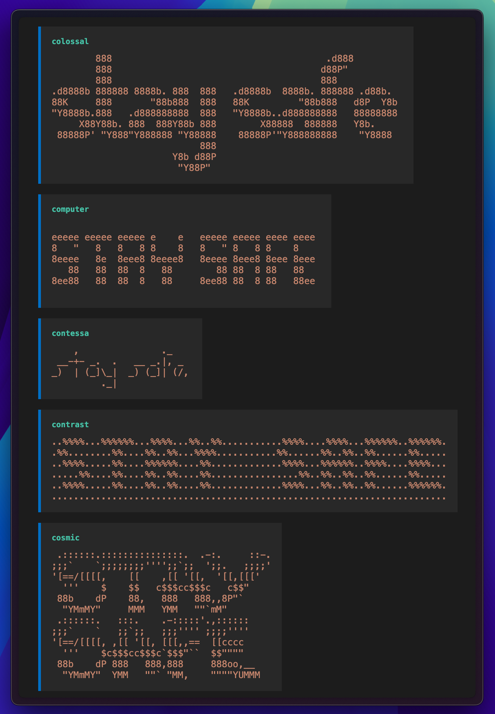

# Filnix

> Fil-C wrapped in Nix

```bash
nix run github:mbrock/filnix#lighttpd-demo
nix run github:mbrock/filnix#nethack
nix run github:mbrock/filnix#filc-shell

# if you don't like watching cmake build llvm for hours
cachix use filc
```


<table>
  <tr>
    <td width="50%">
      
      <p align="center"><i>Lighttpd demo homepage</i></p>
    </td>
    <td width="50%">
      
      <p align="center"><i>Fil-C thwarting out-of-bounds access</i></p>
    </td>
  </tr>
  <tr>
    <td width="50%">
      
      <p align="center"><i>Figlet font gallery (streaming ASCII art)</i></p>
    </td>
    <td width="50%">
      
      <p align="center"><i>QEMU VM boot sequence</i></p>
    </td>
  </tr>
</table>


## What is Fil-C?

[Fil-C](https://github.com/pizlonator/fil-c) by [Filip Pizlo](https://twitter.com/filpizlo) is memory-safe C and C++. It prevents use-after-free, out-of-bounds access, and type confusion without changing your code and without unsafe escape hatches. Every pointer carries hidden capability metadata (bounds + type). All accesses are checked. A concurrent garbage collector prevents use-after-free.

The principle is *Garbage In, Memory Safety Out*.  Even adversarial C code is thwarted immediately. Yeah, yeah, it's a bit slower than "normal" C and right now it's on x64 Linux only. But it works enough to run OpenSSH, CPython, curl, SQLite, Emacs, Trealla Prolog, and over 100 other beautiful programs.

## Try Thwarting Memory Safety

The `runfilc` command compiles and runs C code as a one-liner.  Watch Fil-C in action, protecting your shell and your soul:

```bash
$ nix run .#runfilc -- 'int x[5] = {1,2,3,4,5}; return x[999];'
# filc safety error: cannot read 4000 bytes when upper - ptr = 32.
#     pointer: 0x720fa4708580,0x720fa4708580,0x720fa47085a0
#     expected 4000 writable bytes.
# [pid] filc panic: thwarted a futile attempt to violate memory safety.

$ nix run .#runfilc -- 'char buf[8]; strcpy(buf, "this string is way too long");'
# warning: 'strcpy' will always overflow; destination buffer has size 8, but size 28
# filc safety error: cannot write pointer with ptr >= upper.
#     pointer: 0x741912d05160,0x741912d05150,0x741912d05160
#     expected 8 writable bytes.
# [pid] filc panic: thwarted a futile attempt to violate memory safety.

$ nix run .#runfilc -- 'int *p = malloc(sizeof(int)); free(p); *p = 42;'
# filc safety error: cannot write pointer to free object.
#     pointer: 0x7ee2a5306ab0,0x7ee2a5306ab0,0x7ee2a5306ab0,free
#     expected 4 writable bytes.
# [pid] filc panic: thwarted a futile attempt to violate memory safety.

$ nix run .#runfilc -- 'void *p = malloc(100); free(p); free(p);'
# filc safety error: cannot free pointer to free object.
#     pointer: 0x7f8e4c906ab0,0x7f8e4c906ab0,0x7f8e4c906ab0,free
# [pid] filc panic: thwarted a futile attempt to violate memory safety.

$ nix run .#runfilc -- 'int x = 5; int *p = &x; p += 1000000; return *p;'
# filc safety error: cannot read pointer with ptr >= upper.
#     pointer: 0x7ffd8c3d1004,0x7ffd8c3d0eb4,0x7ffd8c3d0eb8
#     expected 4 readable bytes.
# [pid] filc panic: thwarted a futile attempt to violate memory safety.
```

Every violation is caught with a detailed error showing the pointer values, capability bounds, and full stack trace. The program terminates safely instead of corrupting memory or allowing exploitation.

## Why Nix?

This repository packages Fil-C as reproducible Nix derivations. The [upstream](https://github.com/pizlonator/fil-c) is a development repo with shell-script builds and 100+ vendored projects. This flake takes a different approach: it's modular (compiler separate from applications), reproducible (hermetic builds, binary caching), and integrates with the ecosystem (port any nixpkgs package by overriding stdenv). Memory-safe and regular packages coexist peacefully via
`/nix/store` paths, everything stays moisturized and flourishing.

Currently a standalone flake, working toward nixpkgs integration as a cross-compilation target (`pkgsCross.filc.*`).

## What's Fun Here

### Interactive Memory Safety Demo

The [lighttpd demo](httpd/) runs a complete memory-safe web stack:

```bash
nix run .#lighttpd-demo
```

It's lighttpd compiled with Fil-C, serving CGI scripts in bash and C (both memory-safe), with WebDAV (digest auth), compression (brotli, zstd, bzip2, gzip — all Fil-C). The interactive demo invites you to trigger out-of-bounds access.

The [demo.c](httpd/src/demo.c) CGI has an array of 5 fruits. Try `?index=999` — Fil-C traps it instead of crashing:

```c
const char *fruits[] = {"apple", "banana", "cherry", "date", "elderberry"};
// This will trap with Fil-C:
const char *result = fruits[index];  // index=999
```

The [figlet.sh](httpd/src/figlet.sh) script demonstrates memory-safe bash calling memory-safe figlet, processing results with memory-safe sed/awk, and escaping output with a memory-safe C program.

### Containers & VMs

I'm experimenting with defining a minimal "Linux distribution"
with `runit` as PID1 and a `/bin` full of memory safe goodies.

It's not exactly NixOS, but it's fun and might somehow be useful
for something.

```bash
nix run .#run-filc-docker     # Docker container
nix run .#run-filc-sandbox    # systemd-nspawn
nix run .#run-filc-qemu       # QEMU VM (builds disk image)
```

Each boots into a curated environment with bash, coreutils, tmux, git, curl, OpenSSL, lighttpd web server, SQLite, Lua, Perl, Prolog, and more — all memory-safe.

### Novel Ports

Packages ported here that aren't in upstream fil-c:

| Package | Description |
|---------|-------------|
| lighttpd | HTTP server with mod_cgi, WebDAV, compression |
| nethack | Nobody's ascended in Fil-C Nethack yet... |
| kitty-doom | Console DOOM |
| wasm3 | WebAssembly runtime (see [CVE demos](#cve-prevention-wasm3)) |
| trealla | ISO Prolog with Fil-C FFI integration |
| figlet | ASCII art generator |

### Ports Analysis

The [ports/analysis.md](ports/analysis.md) document is a technical deep-dive generated by squads of Claude AI agents that analyzed every patch from upstream fil-c's 100+ ported projects. Each agent analyzed a subset of patches, then another agent synthesized the findings into a comprehensive guide. It covers systematic porting patterns (pointer tables, tagged pointers, alignment), case studies of major refactors (Python GC, Emacs memory manager, Perl XS), common mistakes and how to avoid them. The scale: 21,000 lines of analyzed changes across projects from dash to systemd. It's both a practical porting guide and a view into what real-world C code assumes about memory.

### Port Configuration DSL

The [ports.nix](ports.nix) file uses a clean DSL for porting packages:

```nix
tmux = port [
  pkgs.tmux
  { inherit ncurses; }
  { inherit libevent; }
  { inherit libutempter; }
  { withSystemd = false; }
];

lighttpd = port [
  (pkgs.callPackage ./ports/lighttpd.nix { })
  { inherit bzip2 openssl pcre2 zlib zstd; }
  (patch ./ports/patch/lighttpd-6a4880a.patch)
  (addCFlag "-Wno-unused-but-set-variable")
];

sqlite = port [
  pkgs.sqlite
  { inherit ncurses readline; }
  (patch ./ports/patch/sqlite.patch)
  skipTests  # TCL test harness needs adaptation
];
```

Hopefully soon we won't need to declare dependencies manually... My goal is to have large parts of Nixpkgs just work automatically without even trying.
