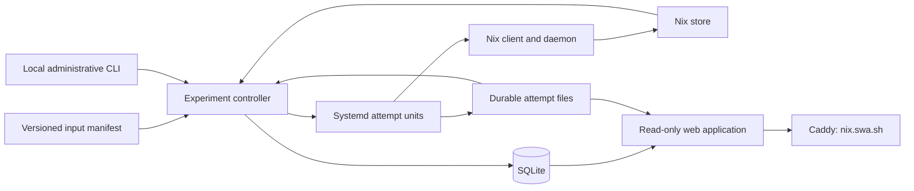

# Filnix experiment runner and dashboard

Status: the initial controller, planner, attempt worker, dashboard, and deployment
are implemented. The inventory is checkpointed at `b14a53e`. See the
[operator guide](experiment-operations.md) for the implemented interface,
calibration evidence, and remaining extensions. The main campaign remains paused.

The application should make the experiment easy to operate and interesting to
watch: what is building, what now works, which test suites ran, and which shared
problem is holding other packages back. Its first input is the existing
[13,772-attribute selection](../experiments/package-inventory/inputs.json).

## The proposed system

Use one small Python application, SQLite, systemd, and the installed Nix daemon.
Python lets the inventory code and its tests carry forward. The application owns
the experiment queue, observations, and presentation. Nix owns derivation
execution, dependency ordering, substitution, and store reuse. Hydra is not a
dependency, and we do not implement another derivation build engine.

Deploy a controller service, a web service, and a fixed systemd template for
individual evaluation/build attempts. The web service serves HTML and a small
JSON API; ordinary browser JavaScript polls for updates and log offsets. Start
with a Nix-pinned production HTTP server, server-rendered pages, and no frontend
build pipeline. The public interface is read-only. Administration uses an SSH
session and the local CLI.

An attempt unit runs independently of the controller, so restarting the
controller or updating the UI does not disconnect an active Nix client. A small
installed launcher can start/stop only the fixed attempt template with a validated
attempt UUID. Attempt commands execute as an unprivileged experiment user. The
web user cannot launch attempts or access the administrative socket.

## Three identities, three kinds of progress

Keep a selected package, a derivation, and an execution attempt distinct.

| Record | Meaning |
| --- | --- |
| Campaign | An input manifest, immutable Filnix checkout, toolchain/input pins, and execution policy |
| Candidate | One selected attribute path in that campaign |
| Derivation | A concrete `.drv` identity, its requested outputs, and dependency edges |
| Attempt | One invocation with its own UUID, systemd unit, timestamps, logs, and outcome |
| Test observation | Evidence about configured or executed checks, tied to the relevant derivation/attempt |
| Event | A numbered change used by the UI and diagnostic history |

Several candidates can resolve to the same derivation. Several candidates can
also require the same library. Deduplicate execution by derivation/output identity
while retaining every candidate-to-result mapping. Count selected attributes and
unique derivations separately.

The campaign records a clean Git revision or an explicitly captured immutable
source snapshot, the manifest hash, Nixpkgs and Fil-C pins, compiler derivation,
Nix version, and policy. It never follows a changing working directory. A recipe
or compiler fix creates a new campaign revision linked to the earlier one;
retrying a timeout on the same recipes creates another attempt.

## Planning and admission

`import` creates a paused campaign. `plan` evaluates its candidates against the
full `pkgsFilc` package set, retaining the existing ports overlay. Evaluation runs
in bounded workers with import-from-derivation disabled. An evaluation exception
or a recipe that needs a build just to evaluate remains an explicit unresolved
input. It does not trigger a build during planning.

Collect derivation edges from Nix, plus dependency-role metadata while the Nix
package objects are available. The derivation graph describes required build
inputs; realized output references later provide a separate view of the installed
closure. These are different graphs. Nix exposes derivation contents through
[`nix derivation show`](https://nix.dev/manual/nix/2.32/command-ref/new-cli/nix3-derivation-show).

Distinguish Fil-C host artifacts, native build tools, and the toolchain's intended
native runtime support. Both native and Fil-C derivations can have an
`x86_64-linux` build system, so that field cannot classify them. Preserve unknown
roles rather than guessing from a package name. The UI's blocker counts refer to
the graph actually evaluated; unevaluated inputs retain their own count.

`run` enables admission. Submit small batches of already evaluated derivations
through one active Nix build invocation, using `--keep-going`. Initially allow
four local builds and request six threads per build. A batch may contain several
candidate roots; Nix schedules their shared dependencies. Avoid multiplying
concurrency by launching a separate unrestricted Nix client for every candidate.

Prioritize inexpensive candidates, candidates with enabled checks, and shared
libraries whose success opens useful groups of packages. Keep some uncertain and
assembly-tagged candidates in the early batches. The queue must not silently
drop an input because it has lower priority.

Known failing derivations block their dependents until a retry or a changed
derivation supplies new evidence. The presentation should say, for example,
“libfoo failed during configure; 84 planned inputs depend on it.” The 84 inputs
are blocked, not 84 independent compilation failures. Preserve all known blockers
and show a dependency chain explaining each relationship.

## Results and evidence

Use independent fields for realization, provenance, test coverage, and artifact
availability. A single green/red field cannot carry all four meanings.

| Observation | What the UI may say |
| --- | --- |
| Required outputs realized | Built/available, with local build, substitution, pre-existing, or unknown origin |
| Compiler/runtime evidence checked | Fil-C provenance checked; mixed or unknown components remain visible |
| Check flag enabled in native inventory | Native recipe enables checks |
| Check flag enabled in the evaluated Filnix recipe | Filnix recipe enables checks |
| Check phase observed to finish successfully | Check phase passed, with a link to evidence |
| A particular suite/import/smoke test observed | That named test passed |
| No execution evidence | Tests not observed or coverage unknown |

Nix can substitute outputs instead of building them, so availability alone does
not establish a fresh build or fresh test run.
[`nix build` semantics](https://nix.dev/manual/nix/2.32/command-ref/new-cli/nix3-build)
should remain visible in the result model. Reused test evidence must identify its
original attempt and match the exact derivation and test profile.

Capture raw stdout and structured stderr from the Nix client before interpreting
them. Isolate `internal-json` handling in a versioned adapter with fixtures from
the installed Nix version. Retain unfamiliar events. Reconcile terminal results
with unit exit records and store validity; an activity disappearing from a log
is not evidence of success. A failed batch's aggregate exit status must not mark
every root failed. Outputs can exist after partial success.

Distinguish recipe/evaluation failures, fetch failures, configure/compile/link
failures, check failures, dependency blockers, timeouts, memory pressure,
cancellation, and controller interruption. A resource-killed attempt is
inconclusive about compatibility. Native comparison builds can be requested when
useful, recording any source/version/feature differences from the Filnix recipe.

For a library, show downstream test evidence from programs that depend on its
Fil-C host artifact. Exclude paths that only use a native build tool. Describe the
evidence as “these dependent programs passed these tests”; it does not prove that
every library API was exercised. This is a particularly useful view for Python,
Perl, Ruby, and Lua native extensions.

## Durable state and recovery

Keep SQLite and attempt files on local disk under
`/var/lib/filnix-experiment/`. The controller is the only database writer. Use WAL,
short transactions, `synchronous=FULL`, and a bounded checkpoint policy. The web
process uses short read-only queries with the necessary access to existing WAL
sidecars. Backups use SQLite's online backup mechanism, not a copy of only the
live database file. These choices follow SQLite's
[WAL concurrency and durability model](https://sqlite.org/wal.html).

For each attempt:

1. Commit its UUID, fixed command arguments, campaign identity, and intended unit
   name before requesting execution.
2. The fixed unit writes raw logs and an atomic completion record to its attempt
   directory. It does not update SQLite.
3. The controller imports observations and log offsets in the same transaction.
   Re-reading a completed range is idempotent.
4. After a controller restart, reconcile intended attempts with unit state,
   completion records, and the Nix store before admitting more work.

This handles a crash before launch, a crash just after launch, lost progress
messages, and a build finishing while the controller is down. A unique unit name
prevents the controller from creating a second unit for the same attempt. Missing
completion evidence leaves an interrupted attempt, not a fabricated outcome.
Retries get new UUIDs. A process exit or PID alone is insufficient recovery data.

Persist campaign mode. Starting the service does not start a newly imported
campaign. A previously running campaign can resume after reconciliation; an
explicitly paused campaign stays paused. `pause` stops admitting new batches and
allows the current batch to drain. `cancel` requests termination of an attempt
and remains pending until termination or completion is established. Verify how
client cancellation propagates to this Nix daemon before relying on it; do not
stop the shared daemon to cancel a campaign.

Register GC roots for the campaign's source/planning data and retained outputs.
Keep artifact availability separate from historical results if an operator later
releases those roots. Set disk/log retention budgets and stop admitting work
before exhausting storage. A log truncated by a budget must be labeled as such.

## Keeping the host usable

Put the Nix daemon and evaluation/build-client attempt units inside one aggregate
`filnix-workload.slice`. Put the controller and web service outside that slice.
The actual builders run under the daemon: limiting just their client units would
not contain them. This intentionally limits all local daemon builds on the host.

Proposed starting policy for this machine:

| Control | Initial setting |
| --- | --- |
| Workload CPUs | `AllowedCPUs=2-15,18-31`, leaving two complete physical cores outside the workload |
| Memory pressure threshold | `MemoryHigh=70%` |
| Aggregate memory ceiling | `MemoryMax=80%`, approximately 99 GiB here |
| Swap ceiling | `MemorySwapMax=2G` |
| Nix parallelism | `max-jobs=4`, `cores=6`, one batch submission at a time |
| Scratch space | A disk-backed directory, rather than this host's tmpfs `/tmp` |

Systemd's memory ceiling can invoke the OOM killer inside the limited group. The
controller should react earlier to memory pressure by withholding new work.
These are kernel-enforced aggregate limits; Nix's thread request is only a
scheduling hint. See the
[systemd resource controls](https://github.com/systemd/systemd/blob/v259/man/systemd.resource-control.xml)
and [Nix parallelism settings](https://nix.dev/manual/nix/2.32/command-ref/conf-file.html#conf-cores).

The current daemon has `use-cgroups=false` and no delegation. Per-build cgroups
are a separate implementation decision, not something to assume already works.
First prove aggregate containment with actual builder PIDs. Initially report
aggregate memory/pressure truthfully; offer precise per-build peaks only when
instrumentation supports them. If an aggregate OOM cannot be attributed to one
builder, record a resource interruption without blaming a particular package.

Bound evaluator memory, processes, build wall time, silence time, and log size.
Set the initial build budgets during the calibration batch and store them with
the campaign policy. Preserve headroom for the controller, Caddy, SSH, and normal
host maintenance. These aggregate limits are installed on `swa`; actual builder
containment was verified during the native calibration batch.

## What watching the experiment looks like

The overview should put useful activity first: current builds and phases, recent
successes with test evidence, and shared blockers. Show fixed input count,
evaluation progress, pending/running/available/blocked/error counts, and separate
test coverage. Include resource usage against the actual limits and the time of
the last successful controller observation. A stale controller must not look live.

The package page shows the selection reason, assembly/mixed-language annotations,
effective Filnix recipe and pins, native versus Fil-C dependency roles, attempts,
test evidence, and bounded live log output. Library pages add the dependent
programs whose tests passed and the inputs currently blocked behind that library.

Dependency navigation should expand around a selected package or blocker, with a
paginated dependent list. Rendering the entire Nix closure as one large animated
graph would obscure the question the viewer is trying to answer.

Use cursor-based JSON updates and bounded log ranges. On reconnect, fetch a fresh
snapshot and continue from its event cursor. This avoids maintaining an elaborate
streaming protocol initially. Escape logs, attributes, and source excerpts as
untrusted text; render only this experiment's captured logs, not the host journal.

Serve the web service over a Unix socket or loopback listener behind an explicit
`nix.swa.sh` Caddy vhost. DNS currently resolves that name, while the Caddyfile has
no explicit vhost for it. Choose and test the local endpoint during deployment,
then validate/reload Caddy and verify the public page and controller freshness.
Keep administrative actions on the local CLI for the first release.

## Existing language work and subsequent inputs

The checkout already has a Perl 5.40 port, Python 3.12 with package overrides,
Ruby 3.3 and gem adaptations, and Lua/Python/Perl environments in
[`demo.nix`](../demo.nix). Tcl and Trealla are also included in the world package
list. LuaJIT is currently marked broken separately from ordinary Lua.

The first campaign keeps the existing input manifest unchanged. Later, add
explicit versioned cohorts for Python native extensions, Perl XS modules, Ruby
gems, and Lua modules using the appropriate Filnix interpreters. Reuse the same
derivation graph and result model. Source changes, dependency substitutions, and
disabled tests inherited from existing overlays remain visible evidence rather
than new “zero modification” claims.

## Implementation checkpoints

1. **Plan and browse.** Import the frozen inventory, evaluate a small selected
   cohort, persist the derivation graph, and serve the paused overview/package/
   blocker views. Use real planning data; no builds required.
2. **One supervised batch.** Implement the Nix adapter, unit lifecycle, durable
   logs, and recovery. Verify actual resource containment and cancellation on a
   small calibration workload before enabling broad admission.
3. **Recovery and evidence.** Test controller restart during a build, missing or
   unfamiliar log events, partial batch success, one dependency blocking several
   roots, timeout/OOM attribution, duplicate aliases, and interrupted writes.
   Check cached outputs do not become invented test passes. Capture and inspect
   the production UI at desktop and narrow widths, including reconnect behavior.
4. **Publish and expand.** Install the Caddy vhost, verify the public status view,
   and then expand the admitted cohort. Add language-specific input sets and
   comparisons as separate checkpoints. Artifact cache publication is a later,
   explicit capability, independent of realizing outputs locally.

Suggested code boundaries are `experiment/model`, `experiment/nix`,
`experiment/controller`, `experiment/attempt`, and `experiment/web`, with systemd
and Caddy templates under `deploy/`. Keep the Nix adapter and recovery state
machine independent of the web framework so they can be tested without a browser
or a running build farm.
